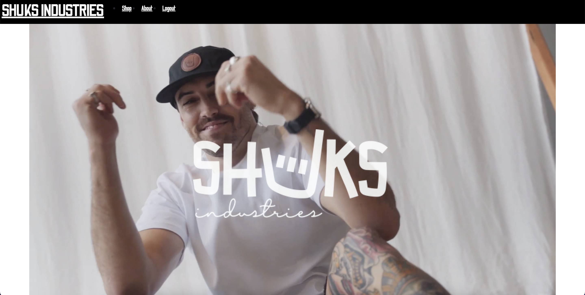

# project3-ecommerce

## Table of Contents

- [Description](#Description)
- [Technologies](#Technologies)
- [Usage](#usage)
- [Contact](#contact)

## Description
This application is a mock eccommerce site that sells apparel and accessiores.
I have created this as an example of how I can use the MERN stack to create a functional website. <a href="">SHUKS INDUSTRIES</a> This application has been made as a mobile first application however it has a responsive design so it can be used on any device.
 
## Technologies
- MongoDB
- Express.js
- React.js
- Node.js
- Stripes
- Redux 

## Usage
When you first arrive on the website you will be greeted with the Shuks Industries Ad on the landing page.

To make a purchace you will need to create an account you can do this by clicking "sign up"

Or if you already have an account you can click "login"

If you click on the navbar link 'shop' you will be taken to the shop section where you can select which items you would like to purchace.

Click on the image to find out more about the item or just click add to cart.
Once you're done selecting your items and they're all added to the cart click on the cart icon in the top right corner to finalise your purchase. 

Click 'Checkout' and you will be redirected to make a payment via Stripe. Simply enter your details to proceed with your purchase.

Once complete you will be redirected to the homepage. 
There is also an about page. If the customer would like to learn more about Shuks.

## Contact
If you would like to ask any questions about the application you can find my contact details on my git hub. <a href="https://github.com/skipsterling">My GitHub</a>

